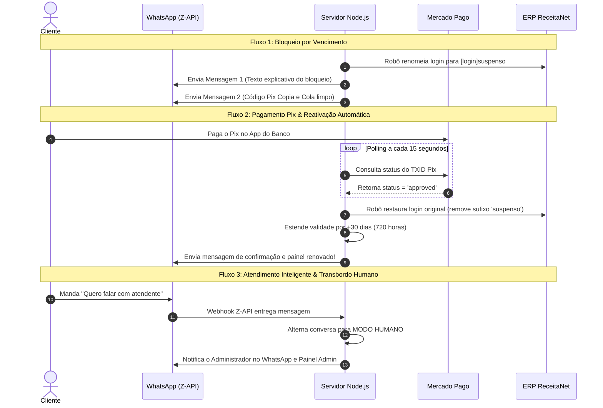

# 🚀 DOCUMENTAÇÃO DO SISTEMA - VERSÃO 1.0 LIMPA

**Plataforma de Automação de TV por Assinatura (AuraTV / SignalPlay)**  
*Integração Completa: ERP ReceitaNet + Mercado Pago Pix + WhatsApp Z-API + Agente IA & Transbordo Humano*

---

## 📌 Status Atual do Sistema (Versão 1.0 Limpa)

| Funcionalidade | Status | Descrição |
| :--- | :---: | :--- |
| **Landing Page & Site** | 🟢 **100% Operacional** | Cadastro de clientes, trial de 4h e compra direta com integração visual de alta performance. |
| **Cobrança Pix Mercado Pago** | 🟢 **100% Operacional** | Geração automática de QR Code Base64 e Pix Copia e Cola via API v1 do Mercado Pago. |
| **Pix Copia e Cola Dedicado** | 🟢 **100% Operacional** | Envio do código Pix em **mensagem 100% separada** para facilidade de cópia no app do banco. |
| **Reativação Automática pós-Pix** | 🟢 **100% Operacional** | Monitor de 15 segundos detecta Pix pago, reativa no ERP ReceitaNet e estende validade por +30 dias. |
| **Bloqueio Físico no ReceitaNet ERP** | 🟢 **100% Operacional** | Robô Puppeteer altera login na aba `DADOS PESSOAIS` para `[login]suspenso` e clica em Salvar via XPath exato. |
| **Reativação no ReceitaNet ERP** | 🟢 **100% Operacional** | Robô Puppeteer restaura login original no ERP e confirma gravação com auditoria. |
| **Disparo de Mensagens no WhatsApp** | 🟢 **100% Operacional** | Integração via Z-API para envio imediato (< 1s) de avisos de suspensão, Pix, boas-vindas e renovação. |
| **Atendimento Inteligente com IA** | 🟢 **100% Operacional** | Robô tira dúvidas de preços (R$ 10/mês), tutoriais do app **SIGNALPLAY** (3 telas) e testes grátis. |
| **Intervenção Humana (Handover)** | 🟢 **100% Operacional** | Pausa o robô automaticamente quando o cliente pede humano ("falar com atendente") com controle no Admin. |
| **Painel de Controle Administrador** | 🟢 **100% Operacional** | Gerenciamento de clientes, botões manuais de liberação/suspensão, console de logs e toggle IA/Humano. |

---

## 🛠️ Arquitetura e Estrutura Técnica

```
tv-pix-platform/
├── server.js               # Servidor Express, Rotas da API, Webhooks (Pix e Z-API) e Polling de 15s
├── cron.js                 # Agendador de checagem de vencimento (5 min) e Polling de Pix
├── database.js             # SQLite local com tabelas: clientes, assinaturas, pagamentos, conversas_bot
├── services/
│   ├── payment.js          # API do Mercado Pago (Pix real, QR Code, Copia e Cola e checagem)
│   ├── whatsapp.js         # API Z-API para disparo instantâneo de WhatsApp
│   ├── receitanetRobot.js  # Robô Puppeteer para automação no ERP ReceitaNet
│   ├── receitanetReal.js   # Integração de formulários/CRM do ReceitaNet
│   ├── aiChatbot.js        # Motor de IA para atendimento automatizado no WhatsApp e Transbordo Humano
│   └── tvPanel.js          # Utilitário auxiliar para painéis SVA
└── public/
    ├── index.html          # Landing Page oficial do serviço de TV
    ├── admin.html          # Painel de Administração Avançado
    └── style.css           # Estilização CSS responsiva e elegante
```

---

## 🗄️ Estrutura do Banco de Dados (`database.sqlite`)

### 1. Tabela `clientes`
* `id` (INTEGER PRIMARY KEY AUTOINCREMENT)
* `nome` (TEXT)
* `email` (TEXT UNIQUE)
* `telefone` (TEXT)
* `cpfcnpj` (TEXT)
* `cep`, `endereco`, `numero`, `bairro`, `cidade`, `uf` (TEXT)

### 2. Tabela `assinaturas`
* `id` (INTEGER PRIMARY KEY AUTOINCREMENT)
* `cliente_id` (INTEGER, FOREIGN KEY)
* `status` (TEXT: `'pendente'`, `'ativa'`, `'suspensa'`, `'vencida'`)
* `data_inicio` (DATETIME)
* `data_vencimento` (DATETIME)
* `login_tv` (TEXT) - Ex: `ellen@tvplus` ou `ellen@tvplussuspenso`
* `senha_tv` (TEXT)
* `aviso_enviado` (INTEGER: 0 ou 1)

### 3. Tabela `pagamentos`
* `id` (INTEGER PRIMARY KEY AUTOINCREMENT)
* `cliente_id` (INTEGER, FOREIGN KEY)
* `txid_pix` (TEXT UNIQUE) - ID da transação no Mercado Pago
* `valor` (REAL)
* `status` (TEXT: `'pendente'`, `'pago'`, `'expirado'`)

### 4. Tabela `conversas_bot`
* `id` (INTEGER PRIMARY KEY AUTOINCREMENT)
* `telefone` (TEXT UNIQUE)
* `modo` (TEXT: `'IA'` ou `'HUMANO'`)
* `ultima_interacao` (DATETIME)
* `historico` (TEXT JSON)

---

## 🔄 Fluxo de Funcionamento (Pontas a Ponta)



---

## ⚙️ Variáveis de Ambiente Necessárias (`.env` / Render)

```env
# Configurações do Servidor
PORT=3000
NODE_ENV=production

# Provedor de Pagamento (Mercado Pago)
MOCK_PAYMENT=false
MERCADOPAGO_ACCESS_TOKEN=APP_USR-xxxxxxxxx

# Provedor de WhatsApp (Z-API)
MOCK_WHATSAPP=false
WHATSAPP_API_URL=https://api.z-api.io/instances/SUA_INSTANCIA/token/SEU_TOKEN/send-text
WHATSAPP_API_TOKEN=SEU_TOKEN_DA_INSTANCIA

# ERP ReceitaNet
RECEITANET_ADMIN_USER=seu_usuario_admin
RECEITANET_ADMIN_PASS=sua_senha_admin
```

---

## 🏁 Conclusão

Esta **VERSÃO 1.0 LIMPA** representa o estado perfeitamente funcional, estável e testado do sistema. Todas as integrações (ERP, Pix, WhatsApp, IA e Painel Admin) encontram-se operacionais e prontas para uso comercial.
